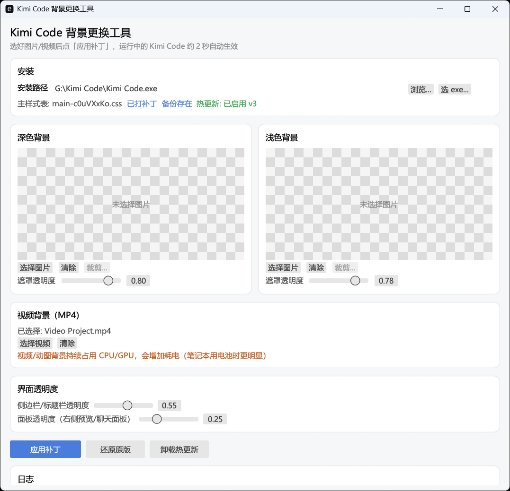

# kimi-code-wallpaper (kimi-bg-tool)

Kimi Code 桌面应用的自定义背景工具：图片、GIF 动图、MP4 视频都能当背景，选好点「应用补丁」，运行中的 Kimi Code 约 2 秒自动换装。深色（月之暗面）、浅色（月之亮面）两种主题各自独立配置。

> **免责声明**：本工具是非官方第三方工具，与月之暗面（Moonshot AI）无关。"Kimi Code" 名称仅用于描述兼容对象。



## 功能

- **自动检测安装路径**：注册表 + 常见路径双重探测，启动即定位安装目录，显示补丁/备份/热更新状态
- **深浅色双槽位**：深色、浅色主题可各配一张壁纸（PNG / JPG / WebP / BMP），各自独立的遮罩透明度
- **GIF 动图支持**：动图原样透传播放（>1.5MB 会提示体积警告）
- **MP4 视频背景**：
  - 自动检测 moov 位置并重封装 faststart（应用内协议不支持分段读取，非 faststart 视频会卡第一帧）
  - 自动剥除音轨/附加轨，只留视频轨（纯搬数据不转码，画质无损，省空间省电）
  - 版本化部署文件名，播放中也能直接换视频，不用先还原
- **内置裁剪编辑器**：非 16:9 图片可红框拖拽裁剪（16:9 / 21:9 / 自由比例），宽屏不再被放大裁脸
- **三档透明度调节**：遮罩透明度（压在背景上保证文字可读）、侧边栏/标题栏透明度、面板透明度（右侧文件预览/侧边聊天面板）
- **热更新**：安装探针后打补丁约 2 秒就地生效，无需重启应用
- **一键还原原版**：首次打补丁前自动备份原样式表（`.wallpaper-bak`），随时反悔
- **配置自动保存**：选项记忆在 exe 旁的 `kimi-bg-tool.conf`，下次启动直接恢复

## 使用

1. 从 [Releases](https://github.com/LJF-0125/kimi-code-wallpaper/releases) 下载 `kimi-bg-tool.exe`（或自行构建，见下），双击运行，免安装
2. 确认识别出的安装路径正确（不对就点「浏览…」/「选 exe…」手动选）
3. 点 **安装热更新**（一次性操作），然后**完全退出并重启 Kimi Code 一次**——此后探针永久生效
4. 选图片（可选裁剪）或选视频，拖好透明度滑块
5. 点 **应用补丁**，运行中的 Kimi Code 约 2 秒内自动换装，无需再重启

> 不装热更新也能用：直接跳到第 4 步，但每次打补丁都要重启 Kimi Code 才生效。

> **注意**：Kimi Code 应用更新会覆盖被补丁的文件（含热更新探针），更新后需重新打补丁并重装探针。「还原原版」可随时恢复未修改状态。

> **耗电警告**：视频/动图背景持续解码占用 CPU/GPU，笔记本用电池时更明显。视频槽为空时点「应用补丁」会移除当前视频背景（日志会有醒目警告）。

## 原理（简述）

Kimi Code 桌面应用是 Electron + Vue，渲染层是散文件（`resources\desktop-dist\`），主进程通过自定义 `app://` 协议每次现读磁盘文件，无完整性校验。本工具向主样式表（`assets\main-*.css`）末尾追加一段标记好的 CSS：

- `:root` 注入壁纸变量（base64 内嵌图）
- `html[data-color-scheme=dark|light|system]` 上铺「壁纸 + 半透明遮罩」背景
- 把 `body / #app / .app / .con / .sidebar-actions` 等透明化（否则 Chromium UA 内置背景会盖住壁纸）
- 侧边栏、右侧面板、侧边聊天（`.sc`）等改为半透明，让壁纸透出来

补丁段有 `kimi-wallpaper-patch` 起止标记，重复打补丁会先清掉旧段再写新段；还原即恢复备份文件。

### 热更新原理

「安装热更新」向 `index.html` 注入一段探针脚本（带 `kimi-wallpaper-hot-hook` 标记，可一键卸载）：探针每 2 秒 fetch 一次版本文件 `kimi-wallpaper-hot.json`，版本号变化时才拉取 `kimi-wallpaper-hot.css` 并注入 `<style>` 就地换装。「应用补丁」只需重写这两个文件，运行中的应用约 2 秒内自动生效。由于 `app://` 协议每次请求都现读磁盘，轮询到的永远是最新内容；版本号对比保证不重绘、开销可忽略。

### 视频背景原理

CSS 做不了视频背景，由探针动态注入：json 里有视频文件名时，探针在 body 里建 `<video>` 元素（z-index: -2，静音循环）+ 遮罩 div（z-index: -1）。由于 `app://` 协议对 mp4 返回 `application/octet-stream` 且不支持 Range 请求（Chromium 媒体栈直接拒播），探针改为 fetch 读成 blob 再喂给播放器，绕开协议层。视频文件以版本化文件名（`kimi-wallpaper-video-<时间戳>.mp4`）部署，避开 Windows 对正在播放文件的占用锁，旧文件惰性清理。

## 当前限制

- Kimi Code 大版本更新后若 CSS 类名变更，透明化规则可能需要跟进
- 仅支持 Windows

## 从源码构建

需要 Rust 工具链（stable）：

```bash
cargo build --release
# 产物：target\release\kimi-bg-tool.exe（约 7 MB）

cargo test --release   # 37 个单元测试
```

技术栈：Rust + [egui/eframe](https://github.com/emilk/egui)（GUI）、image（压图）、rfd（文件选择框）、winreg（安装路径探测）。MP4 的 faststart 重封装与音轨剥除为自实现（纯搬盒子，无 ffmpeg 依赖）。GUI 中文字体在启动时加载系统微软雅黑（`C:\Windows\Fonts\msyh.ttc`）。

## License

[MIT](LICENSE)
